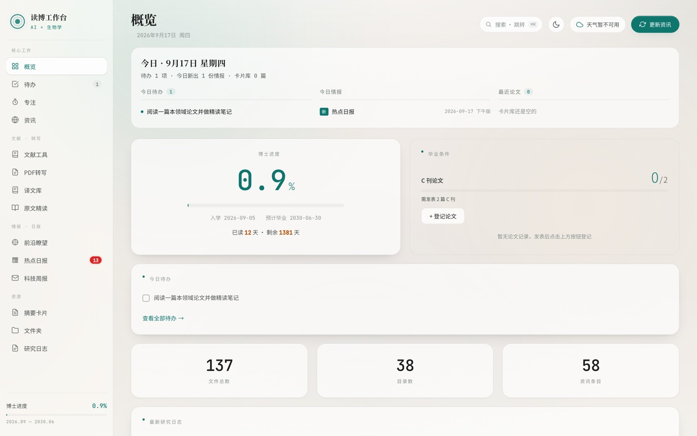
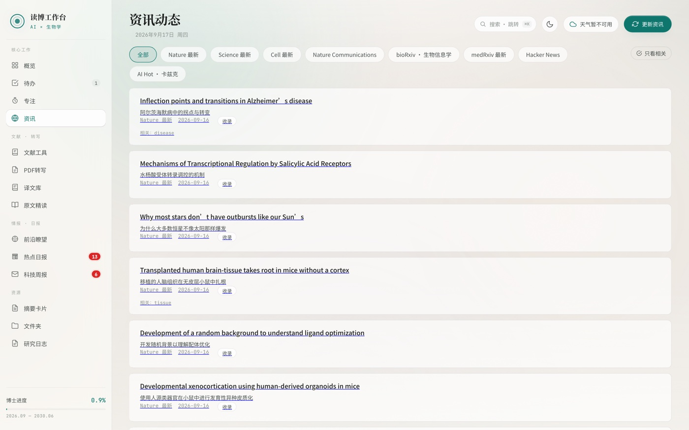
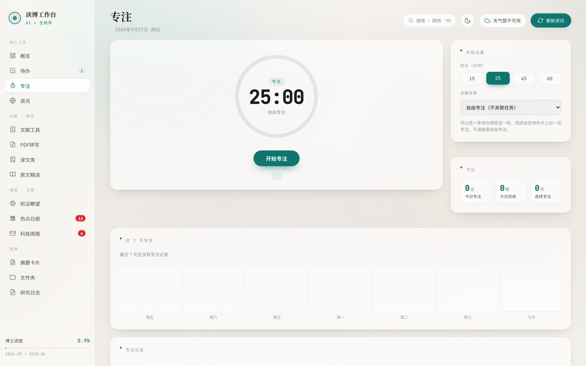
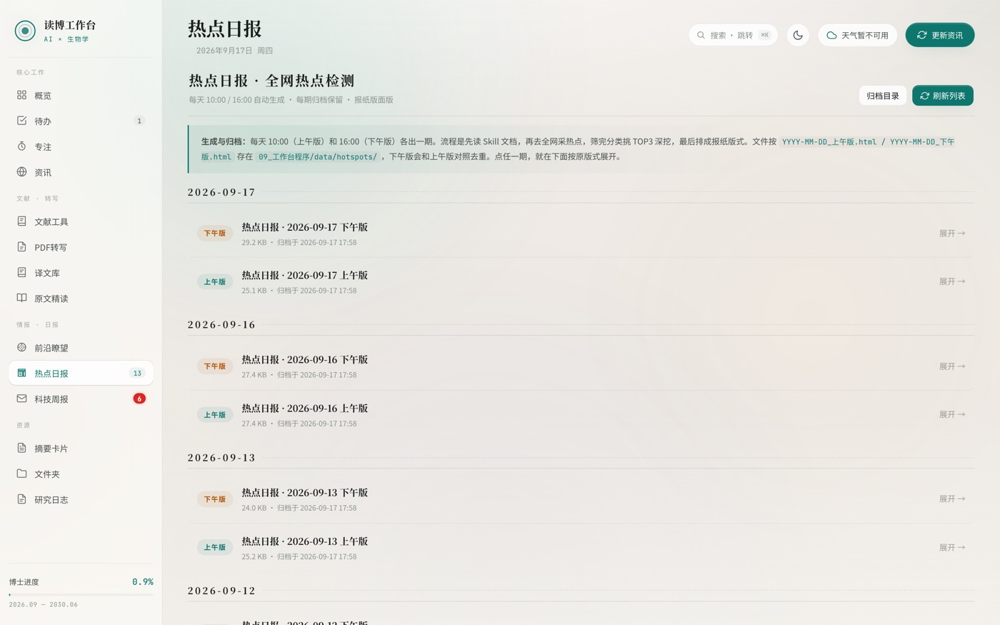
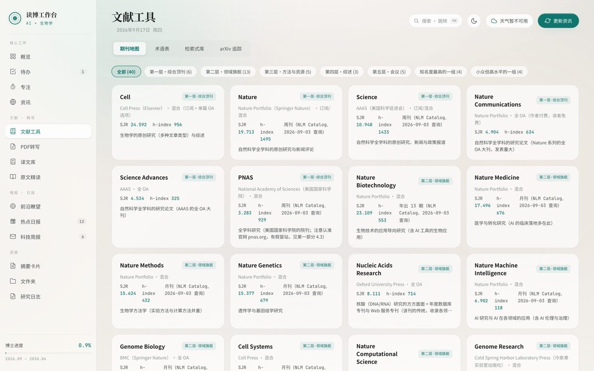

<div align="center">

# 学术工作台 · Academic Workbench

**一个跑在你自己电脑上的免费学术工作台。**
本科写毕设、硕士做课题、博士攻论文，都能用同一套流程：
把「追踪文献 → 转写 PDF → 存摘要卡 → 精读对照 → 记录日志」串成一条流水线，
14 个面板、零第三方依赖、全部用免费服务驱动。


[](https://github.com/wujing855/academic-workbench/releases)
[](https://github.com/wujing855/academic-workbench/stargazers)
[](https://github.com/wujing855/academic-workbench/commits/main)


[怎么装](#最快的用法把这串网址发给你的-ai-agent) · [面板一览](#面板一览) · [常见问题](#常见问题)

⭐ **如果这套工作台帮到了你，欢迎点个 Star 支持一下** —— 也让更多埋头做研究的人看见它。



</div>

---

## 最快的用法：把这串网址发给你的 AI Agent

**你不需要会写代码，不需要打开终端，不需要自己装 Python，也不需要改任何文件。**

复制下面这段，发给你手边的 AI Agent（WorkBuddy / TRAE / 豆包，或任何能读写文件的 AI）：

> 帮我装这个工作台：`https://github.com/wujing855/academic-workbench`
> 请照着仓库里 `SKILL/SKILL.md` 的部署向导做：先问我该问的问题，剩下的安装和配置你来做，装完逐项验证一遍再交给我。

接下来它会：

1. **一次问你 10 个问题**（读哪个学段、几年级、什么研究领域、用哪家模型……）—— 你只要答这些
2. **自己把工作台装好并配成你的**：进度卡是你的学段年级、侧栏是你的研究领域、资讯源换成你领域的期刊
3. **帮你把 PDF 转写引擎装好**（本地引擎它来装；它还会问你要不要顺便开"云端加速"——注册个免费账号就行，速度快、**不占你电脑性能**，很推荐）
4. **帮你建好每日自动化**：前沿日报、热点日报、每周科技周报，不用你管也会自己产出
5. **最后逐项自检**（资讯 / 天气 / 摘要 / 翻译 / 精读 / 转写 / 进度卡）确认都能用，再交付给你

你全程只做两件事：**回答问题** + **注册 2~3 个免费账号、把它要的 Key 贴给它**。

### Agent 会问你的（可以先想想答案）

| # | 问题 | 备注 |
|---|---|---|
| 1 | 你的研究方向怎么称呼？（如「清代文献学」） | 显示在侧栏和浏览器标题 |
| 2 | 你现在读 **本科 / 硕士 / 博士**？ | 决定进度卡的标题与年级名 |
| 3 | 现在**几年级**？或哪一年入学？ | 用来算进度（默认 9 月开学、6 月毕业） |
| 4 | 学制**几年**？ | 默认：本科 4 年、硕士 3 年、博士 4 年 |
| 5 | 研究领域是什么？ | 换资讯源、前沿日报、文献检索式 |
| 6 | 最想追踪什么期刊 / 关键词？ | 同上 |
| 7 | AI 模型用哪家？ | **推荐阿里云百炼**（免费额度多），也可 DeepSeek 或其它 |
| 8 | 天气要不要？ | **推荐和风天气**（免费、每天 1000 次、更准） |
| 9 | PDF 要不要云端加速？ | 本地引擎免费离线；**云端加速推荐**（免费额度、不占电脑） |
| 10 | 每日自动化要不要？ | 前沿日报 / 热点日报 / 周报 |

> **如果 Agent 没按这套流程走**（比如它直接开始敲命令、却没问你学段和领域），把仓库里 [`SKILL/SKILL.md`](SKILL/SKILL.md) 的内容贴给它，或直接说："按 SKILL.md 的部署向导来，先问我问题。"

## 这是什么

不管是本科写毕设、硕士做课题，还是博士攻论文，最耗神的往往不是研究本身，而是**文献工作流太碎**：早上刷期刊、看到好文章下载、读一半卡在英文、想记点想法又懒得开笔记软件……一天下来真正推进研究的时间被切碎了。

这个工作台最初是我给自己搭的一套本地工具，把这些环节收进一个页面：

| 环节 | 以前 | 现在 |
|---|---|---|
| 追文献 | 开 4 个期刊网站来回刷 | 早晨打开「资讯」看一屏聚合 |
| 读论文 | 下载 → 手动复制 → 网页翻译 | 拖进「PDF 转写」→ 自动出 Markdown → 「译文库」全文中译 |
| 抓重点 | 自己划线摘抄 | 「摘要卡片」结构化摘要，标签自动建议 |
| 精读 | 英文原文与翻译来回切 | 「原文精读」逐段三级对照：译文 / 原文 / 解读 |
| 记想法 | 散在各处 | 「研究日志」还能直接链接到某张摘要卡 |
| 专注 | 番茄钟 App | 内置「专注」面板，计时不怕切标签页 |

**所有数据都留在你电脑的 `data/` 目录里**，不经过任何第三方服务器；模型调用走你自己的 API Key。

## 面板一览

14 个面板，按使用频率分四组：

| 组 | 面板 |
|---|---|
| 核心工作 | 概览 · 待办 · **专注**（番茄钟） · 资讯 |
| 文献 | 文献工具 · PDF 转写 · 译文库 · 原文精读 |
| 情报 | 前沿瞭望 · 热点日报 · 科技周报 |
| 归档 | 摘要卡片 · 文件夹 · 研究日志 |

<table>
<tr>
<td width="50%"><br><sub>资讯：学术/科技源聚合，顶刊标题自动中译</sub></td>
<td width="50%"><br><sub>专注：番茄钟用时间戳计时，切标签页也不走偏</sub></td>
</tr>
<tr>
<td width="50%"><br><sub>热点日报：每天早晚各一期，AI 生成</sub></td>
<td width="50%"><br><sub>亮 / 暗双主题</sub></td>
</tr>
</table>

更多界面截图见 [`docs/screenshots/`](docs/screenshots/)。

## 你可能会用到的免费服务

工作台**不配任何 Key 也能用**（待办、资讯、专注、周报、日志、文件夹都能跑）。下面三个是可选的增强，都有免费额度：

| 功能 | 推荐服务 | 免费额度 | 填进哪个文件 |
|---|---|---|---|
| AI 摘要 / 翻译 / 精读 | [阿里云百炼](https://bailian.console.aliyun.com)（也可 DeepSeek 或其它 OpenAI 兼容服务） | 每天有免费 tokens，推荐 `qwen3.8-flash` | `data/llm_config.json` |
| 天气卡片 | [和风天气](https://www.qweather.com) | 每天约 1000 次（**Host 和 Key 是两个值**） | `data/weather_config.json` |
| 云端 PDF 转写 | [MinerU](https://mineru.net/apiManage/token) | 每天 2000 页，Token 90 天有效 | `data/pdf_config.json` |

每个文件都有对应的 `*.example.json` 模板，**复制改名再填**即可（真实配置已被 `.gitignore` 排除，不会误传）。

> PDF 也想在本地转写（不消耗云端额度、不联网）：`cd pdf_worker && python3 -m venv .venv && .venv/bin/pip install -U mineru`，转写时选「本地引擎」。**本地 + 云端可以都配上，界面上随时切换。**
>
> 免费额度是各家给的试用政策，**会调整** —— 以官网为准。

## 想自己动手装（可选，不推荐给非程序员）

如果你不想用 Agent，也可以手动来 —— 需要你有 Python 3（macOS 自带，Windows 去 python.org 装）：

```bash
git clone https://github.com/wujing855/academic-workbench.git
cd academic-workbench
python3 server.py          # macOS 也可以直接双击 start.command
```

浏览器打开 **http://127.0.0.1:8765**。待办、资讯、专注、周报、日志这些面板**不配任何 Key 就能用**。

### 手动配置自己的学段与进度

进度卡默认显示「学业进度 · 待设置」，因为它**不会猜**你的学制 —— 请复制 `data/settings.example.json` 为 `data/settings.json` 后填：

```json
{
  "field_name": "你的研究领域（显示在侧栏和浏览器标题上）",
  "degree_level": "本科 / 硕士 / 博士",
  "program_years": 4,
  "phd_start": "2025-09-01",
  "phd_end": "2029-06-30",
  "c_journal_required": 2,
  "c_journal_label": "毕业要求名称（SCI 一区 / CSSCI / C 刊论文…）",
  "workspace_dir": "「文件夹」面板要扫描的目录（留空则用上一级目录）"
}
```

- `degree_level` 决定进度卡标题与年级名：本科 → 「本科进度 · 大三」，硕士 → 「硕士进度 · 研二」，博士 → 「博士进度 · 博二」。
- `phd_start` / `phd_end` 填了才显示进度（国内一般 9 月开学、6 月毕业）。
- **改完要重启服务**（这些值在启动时读取）。

改完刷新页面，侧栏下方就会显示你自己的领域名 —— **它不该看起来像别人的工具**。

## 让 AI Agent 帮你定制

这个仓库的设计是**留空缺**：资讯源关键词、前沿日报主题、文献检索式都是填空位。
[`SKILL/`](SKILL/) 里是一份给 **AI Agent** 看的说明书（不是给人看的教程）—— 把仓库丢给你的 Agent，它会先问你要 10 个信息，再把这套骨架改造成你自己的，并帮你装好 PDF 引擎、配好模型、建好每日自动化，最后逐项自检。

| 你用的 Agent | 怎么接 |
|---|---|
| **WorkBuddy** | 把 `SKILL/SKILL.md` 放进技能目录，或直接说「按这个仓库的 SKILL.md 帮我装」 |
| **TRAE** | 见 [`SKILL/TRAE-规则适配.md`](SKILL/TRAE-规则适配.md)，设为项目规则 |
| **豆包** | 见 [`SKILL/豆包-提示词适配.md`](SKILL/豆包-提示词适配.md)，当提示词贴 |

三者都有免费额度（WorkBuddy / TRAE 可签到领积分，豆包学生认证有会员额度）。

## 项目结构

```
academic-workbench/
├── server.py              主服务（8765 端口，纯标准库）
├── fetchers.py            资讯源与天气抓取（改这里换你的领域期刊）
├── pdf_worker/            PDF 转写引擎（8766 端口，MinerU 驱动，本地/云端双引擎）
├── web/                   前端（原生 HTML/CSS/JS，无框架）
├── ai-bio-kit/            「前沿瞭望」Agent 指令包（领域可换）
├── SKILL/                 给 AI Agent 的部署向导（SKILL.md + 两个适配）
├── docs/screenshots/      README 用的界面截图
└── data/                  所有数据与配置（业务数据都在这里）
```

改资讯源：编辑 `fetchers.py` 顶部的 `SOURCES` 数组，加一条就是加一个源。

## 常见问题

**Q：我完全不懂代码，能装吗？**
能。把[最快的用法](#最快的用法把这串网址发给你的-ai-agent)里那段话发给你的 AI Agent 就行，它会全程代劳，你只需要回答问题、注册几个免费账号。

**Q：进度卡显示的还是「他人的进度」或「待设置」？**
说明 `data/settings.json` 里的学段与起止日期没配（或改完没重启服务）。对 Agent 说一句「帮我设置学段和学制」，它就会问你是本科/硕士/博士、几年级，然后替你填好。

**Q：资讯一片空白？**
你可能开着代理。国内源（Nature / HN / 阮一峰等）代码里已强制直连；反过来，个别国外源（如 PhilSci）反而需要代理，属正常。

**Q：AI 功能报 `HTTP 403 FreeTierOnly`？**
免费额度当天用完了。改 `data/llm_config.json` 把对应任务换成 `qwen3.8-flash`（最耐用），或次日再用。

**Q：天气必须注册吗？**
不必须。不填天气区会显示「天气暂不可用」，其他一切正常。注册（和风天气，免费）只是为了天气更准。

**Q：PDF 转写会吃我电脑性能吗？**
两个引擎随你选：**本地引擎**免费、离线，但转写时吃本机 CPU；**云端加速**（MinerU，免费注册）把计算放到云端，**不占你电脑性能、速度也快得多**——推荐开着它，本地引擎留着当离线备用。

**Q：数据能带走 / 备份吗？**
整个 `data/` 目录就是你的全部数据，复制走即可。

**Q：它会自动把我改的东西 git commit 吗？**
不会，这个功能**默认关闭**。只有你在 `data/settings.json` 里写 `"auto_archive": true` 之后，它才会在每天凌晨 3 点后第一次运行时执行一次 `git add -A` + `git commit -m "自动存档 <日期>"`。之所以默认关：它会把**你当时所有未提交的改动**一起提交进这个目录的 git 历史——只有当你确定这个目录就是你自己的仓库时才该打开。

**Q：端口被占了？**
改 `server.py` 顶部的 `PORT` 和 `WORKER_BASE`（两处要一致），并在 `start.command` 里同步。

## 许可与致谢

MIT License —— 随便用、随便改，保留版权声明即可。

数据源与服务：[阿里云百炼](https://bailian.console.aliyun.com) · [MinerU](https://mineru.net) · [和风天气](https://www.qweather.com) · Nature / Science / Cell / bioRxiv / Hacker News 等公开 RSS。
AI Agent 协作：[WorkBuddy](https://www.workbuddy.cn) · TRAE · 豆包。

如果这套工作台帮你省下了一点时间，欢迎点个 ⭐ —— 也欢迎告诉我你加了什么我没想过的东西。
